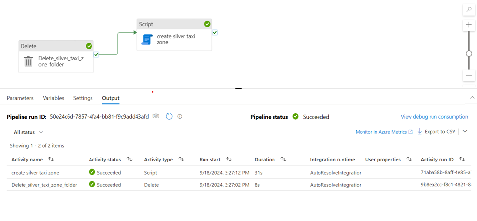
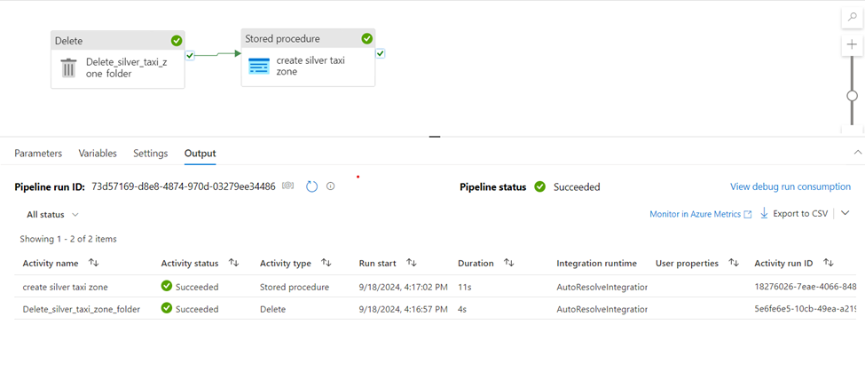
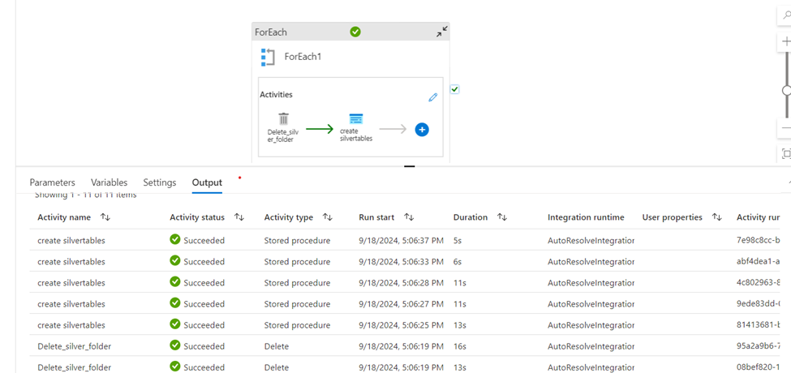
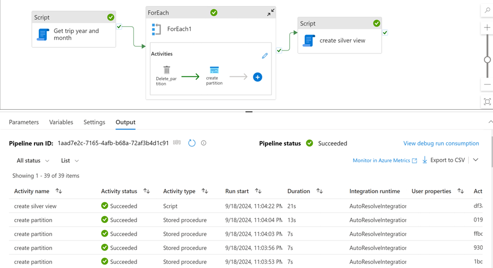
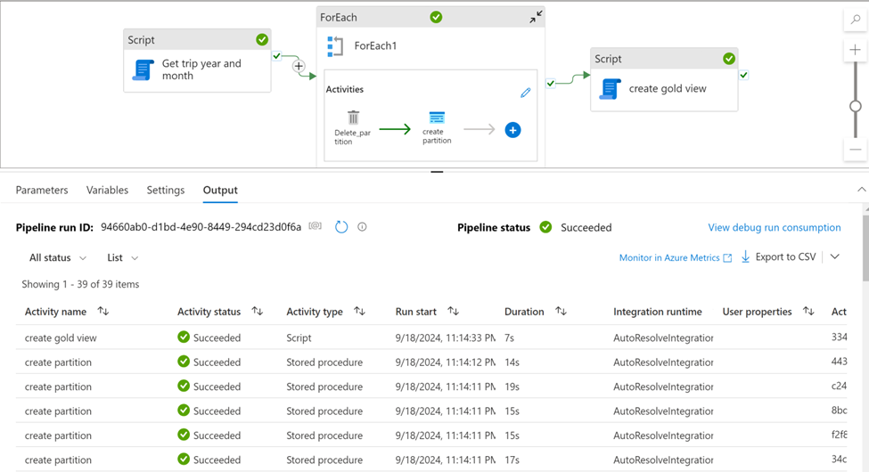
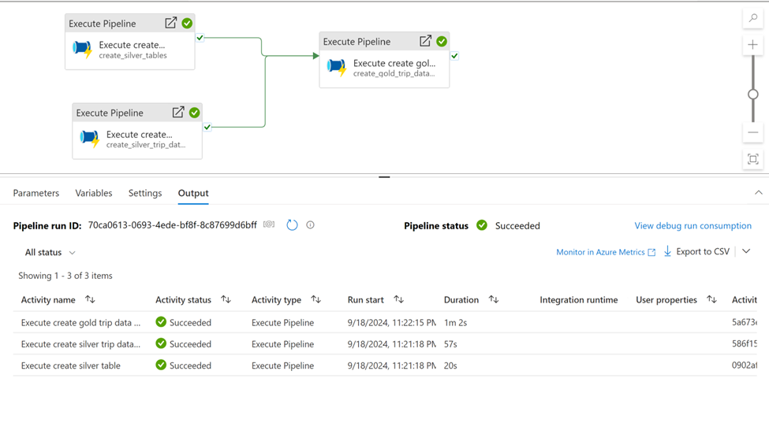
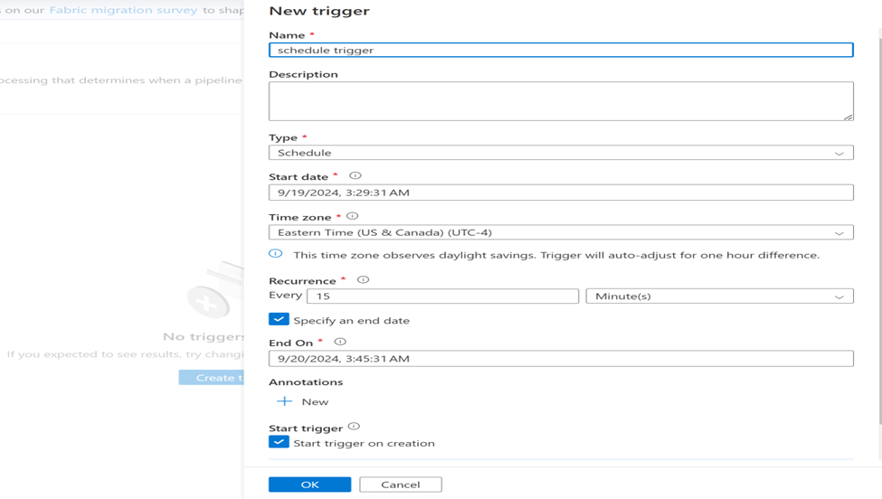

# Nyc-taxi-data-azure-data-engineering-project
In this Project i have  implemented a data engineering solution using all services available on Azure Synapse Analytics to analyze and report data on Taxi Green trips in New York City from 2020 to 2021.

About the Dataset:

This dataset contains information about NYC Green trips from 2020 and 2021. -  NYC Green Trip Data

The data was transformed to different file types, and I worked with them in the Synapse Workspace to ingest (Extract), Tranform, and Load data using Serverless Pool:

Dimension Table:

  1.Taxi Zone
  
      • CSV file with header
      • CSV file without header
      
  2.Calendar
  
      • CSV file
      
  3.Vendor
  
      •CSV file
      •CSV file with escaped characters( \ )
      •CSV file with unquote (" ")
      
  4.Rate Code
  
      •JSON file

  5.Trip Type
  
     •TSV, Tab-Separated
     
  6.Payment Type
  
     •JSON file
     •JSON file with array

     
 Fact Table:

1.Trip Data Green

    •CSV file with Partitioned by Year and Month
    •Parquet file with Partitioned by Year and Month
    •Delta file with Partitioned by Year and Month

1. Initial Setup:

    • create a database & give collation &UTF
    • create schema for Bronze, Silver, Gold
    • Create External data source ,External File format

2. Create an External table (Bronze):

3. Create a view for Bronze:

4. (Bronze -Silver) Transformation:

Transform all the CSV Files into Parquet for better Efficiency.

5. Create a view for Silver:

6. (silver -Gold) Transformation:

here, we Join the Tables required,give some cases required.

7. create a view for Gold

BRONZE – SILVER Transformation using serverless synapse using Pipeline.

1. Create a linked service for ADLS,AZURE SYNAPSE ANALYTICS(serverless).

2. Create a Dataset for ADLS.

3. In the Script activity, write the query for external table.

4. instead of using script activity use stored procedure activity

5. instead of creating 7 pipelines,7 datasets we have parameterized the folder path.

6. created a silver view by using the stored procedure code already used

7. created a gold view by using the stored procedure code already used.

8. Execute the pipeline based on our Requirement:

 9. Execute the pipeline by giving triggers:

